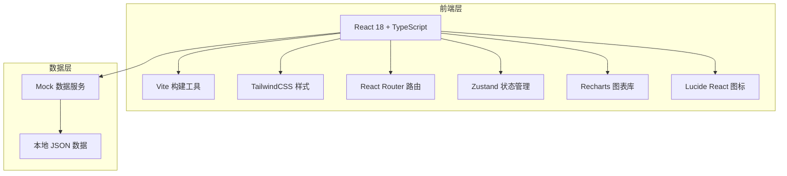
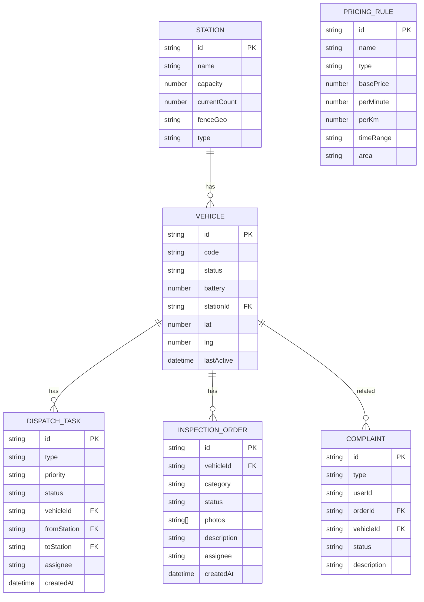

## 1. 架构设计

## 2. 技术说明
- 前端：React@18 + TypeScript@5 + TailwindCSS@3 + Vite@5
- 路由：react-router-dom@6
- 状态管理：zustand@4
- 图表库：recharts@2
- 图标：lucide-react
- 后端：无后端，采用前端 Mock 数据模拟
- 数据：本地 TypeScript Mock 数据

## 3. 路由定义
| 路由 | 页面 | 说明 |
|------|------|------|
| / | 重定向到 /dashboard | 首页 |
| /dashboard | 运营看板 | 核心指标和图表 |
| /vehicles | 车辆列表 | 车辆管理和控制 |
| /stations | 站点管理 | 站点和围栏配置 |
| /dispatch | 调度任务 | 调度任务管理 |
| /inspection | 巡检工单 | 巡检和维修工单 |
| /complaints | 用户投诉 | 投诉处理 |
| /pricing | 价格规则 | 定价和优惠配置 |
| /reports | 报表统计 | 数据分析报表 |

## 4. 数据模型

