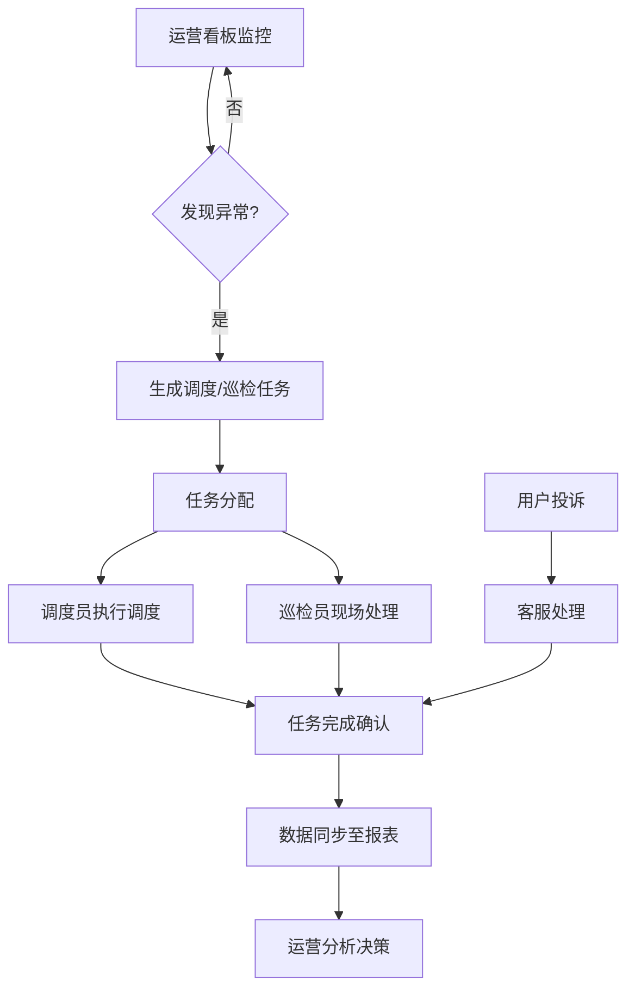

## 1. 产品概述
共享电单车管理系统是面向城市运营团队的后台管理 Web 应用，用于统一管理车辆、站点、调度、巡检和用户服务。系统通过数据看板和可视化工具，帮助运营团队实时监控车辆状态、优化调度效率、处理用户投诉，提升整体运营质量和用户体验。

- 目标用户：城市运营管理团队、调度员、巡检员、客服人员
- 核心价值：数据驱动的精细化运营，降低运维成本，提升车辆周转率

## 2. 核心功能

### 2.1 用户角色
| 角色 | 核心权限 |
|------|----------|
| 运营管理员 | 全功能访问，数据看板，价格规则配置 |
| 调度员 | 调度任务管理，车辆状态查看，站点管理 |
| 巡检员 | 巡检工单处理，拍照上报，维修记录 |
| 客服人员 | 用户投诉处理，订单查询，车辆定位 |

### 2.2 功能模块
1. **运营看板**：车辆在线数、可骑数、低电量、异常停放、订单走势图表
2. **车辆列表**：编号搜索、地图定位、状态切换、远程锁车、换电记录
3. **站点管理**：电子围栏配置、容量设置、禁停区、推荐还车点
4. **调度页面**：按缺车、满车、低电量生成调度任务
5. **巡检工单**：拍照上报、维修分类、处理进度、复核
6. **用户投诉**：乱停、扣费、找车问题处理
7. **价格规则**：时段、区域、优惠设置
8. **报表统计**：骑行热区、周转率、故障率、人员绩效

### 2.3 页面详情
| 页面名称 | 模块名称 | 功能描述 |
|---------|----------|---------|
| 运营看板 | 核心指标卡片 | 展示车辆总数、在线数、可骑数、低电量数、异常停放数 |
| 运营看板 | 订单走势图表 | 近7日/30日订单量折线图 |
| 运营看板 | 实时地图 | 车辆分布热力图，异常标记 |
| 运营看板 | 告警列表 | 最新异常事件滚动展示 |
| 车辆列表 | 搜索筛选 | 按编号、状态、电量、站点筛选 |
| 车辆列表 | 车辆表格 | 车辆编号、状态、电量、位置、最后活跃时间 |
| 车辆列表 | 车辆详情 | 换电记录、行程历史、远程控制（锁车/解锁） |
| 站点管理 | 站点列表 | 站点名称、位置、容量、当前车辆数、状态 |
| 站点管理 | 电子围栏 | 地图上绘制/编辑站点围栏范围 |
| 站点管理 | 禁停区配置 | 设置禁停区域和推荐还车点 |
| 调度页面 | 任务生成 | 缺车/满车/低电量自动生成调度建议 |
| 调度页面 | 任务列表 | 调度任务状态、优先级、分配人员 |
| 调度页面 | 任务执行 | 确认取车/还车，更新任务状态 |
| 巡检工单 | 工单列表 | 待处理/处理中/已完成工单 |
| 巡检工单 | 新建工单 | 拍照上传、问题分类、位置标记 |
| 巡检工单 | 工单处理 | 维修记录、进度更新、复核确认 |
| 用户投诉 | 投诉列表 | 乱停/扣费/找车等分类展示 |
| 用户投诉 | 投诉处理 | 关联订单/车辆，处理记录，用户回复 |
| 价格规则 | 基础定价 | 起步价、时长费、里程费配置 |
| 价格规则 | 时段定价 | 高峰/平峰/夜间差异化定价 |
| 价格规则 | 区域定价 | 不同运营区域定价差异 |
| 价格规则 | 优惠活动 | 折扣券、满减、会员优惠配置 |
| 报表统计 | 骑行热区 | 区域骑行热度地图和排名 |
| 报表统计 | 周转率 | 车辆日均使用时长、骑行次数 |
| 报表统计 | 故障率 | 车辆故障分类统计、趋势分析 |
| 报表统计 | 人员绩效 | 调度/巡检人员工作量和完成率 |

## 3. 核心流程
运营团队日常工作流程：运营管理员通过看板监控整体运营状态，发现异常后调度员生成调度任务，巡检员接收工单并现场处理，客服同步处理用户投诉，所有数据沉淀到报表系统供决策分析。

## 4. 用户界面设计

### 4.1 设计风格
- 主色调：科技蓝 (#1E6FED) 搭配深灰 (#1F2937)
- 辅助色：成功绿 (#10B981)、警告橙 (#F59E0B)、危险红 (#EF4444)
- 按钮风格：圆角 8px，带悬停阴影过渡
- 字体：系统无衬线字体，标题粗体，正文常规
- 布局风格：左侧导航栏 + 顶部状态栏 + 内容卡片化布局
- 图标风格：Lucide 线性图标，简洁统一

### 4.2 页面设计概览
| 页面名称 | UI 元素 |
|---------|---------|
| 运营看板 | 大尺寸指标卡片、折线图/柱状图、地图容器、告警滚动条 |
| 车辆列表 | 搜索栏、筛选标签、数据表格、详情抽屉 |
| 站点管理 | 站点卡片列表、地图围栏编辑器、配置表单弹窗 |
| 调度页面 | 任务看板（待处理/进行中/已完成）、任务详情卡 |
| 巡检工单 | 工单列表、照片上传区、处理流程时间线 |
| 用户投诉 | 投诉分类标签、对话式处理记录、关联信息面板 |
| 价格规则 | 规则卡片、价格配置表单、预览计算器 |
| 报表统计 | 多维度图表、数据表格、导出按钮 |

### 4.3 响应式
采用桌面优先设计，支持 1280px 及以上分辨率最佳显示。关键数据区域支持横向滚动，导航栏在小屏幕可折叠。
